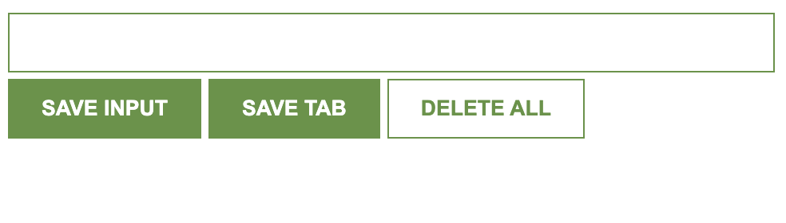
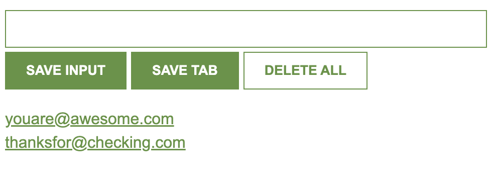

# Chrome Extension

This project was made for educational purposes.

Similar to the favourites bar, instead of saving web site addresses, this extension saves email addresses, which could be useful for recruiters, people who work in sales, or others who send a lot of emails.

Apart from being able to create an adjustable email address 'book', the applications of this simple component can be amplified when working with large APIs in React.

I'd even say this could be applied to having a mini to-do list at the top of your browser. Delete each line as you complete each task!

## This is what the landing page looks like

## Once you add emails to the list, you can always delete them, however, when either button is pressed, you still need to click on refresh to complete the action as it uses your local storage. 

## Special thanks to: 

Per Herald Borgen at Scrimba